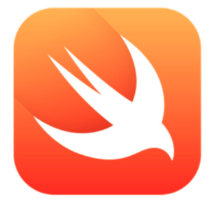

# Curso de Introdução ao desenvolvimento para iOS - Swift

## Objetivo

 - Compreender o fluxo do desenvolvimento de aplicativos IOS
 - Compreender a linguagem de programação Swift Conhecer a arquitetura das aplicações iOS Familiarizar-se com os principais componentes UI - User Interface
 - Criar a navegação entre as diferentes telas de um app Acesso a um banco de dados ao aplicativo
 - Realizar a integração com WebServices
 - Utilização de Mapas
 - Customização de interface

## Conteúdo

 - Introdução ao desenvolvimento para iOS
 - A linguagem Swift
 - Arquitetura das aplicações
 - Navegando entre diferentes telas/controllers Principais componentes de interface Utilização de Mapas
 - Banco de dados com iOS: Core Data e NSUserDefaults CocoaPods
 - Projeto Final

### Slides

[Slides](http://cdn.rawgit.com/jacksonfdam/ios-swift/master/slides.html#1)
